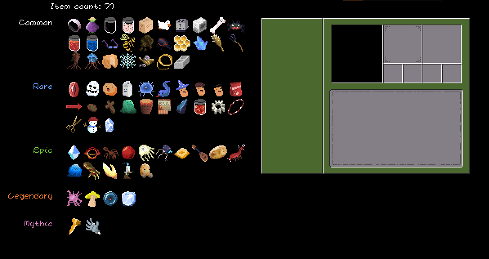
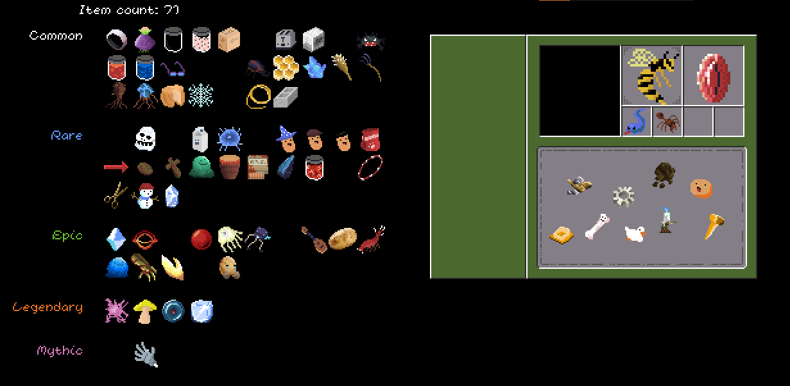
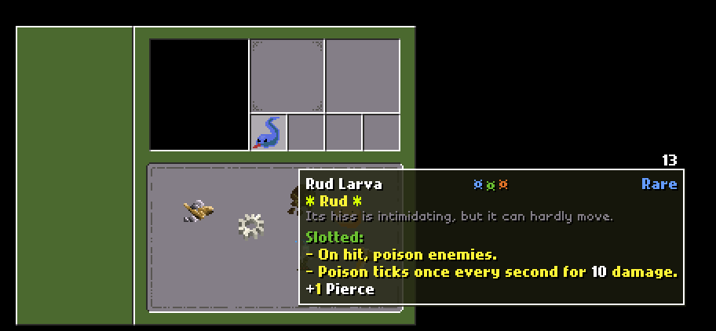
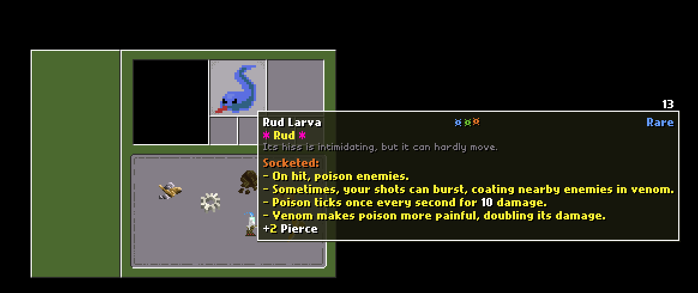

Experimental inventory system. 
- Features a snappy gui, effect support, and a way to add items to the system. 
- This is not yet feature complete; I want to make it so that equipping items in slots affects a stat sheet.

Unique system!
- Items have different effects based on where you put them in the little inventory.

